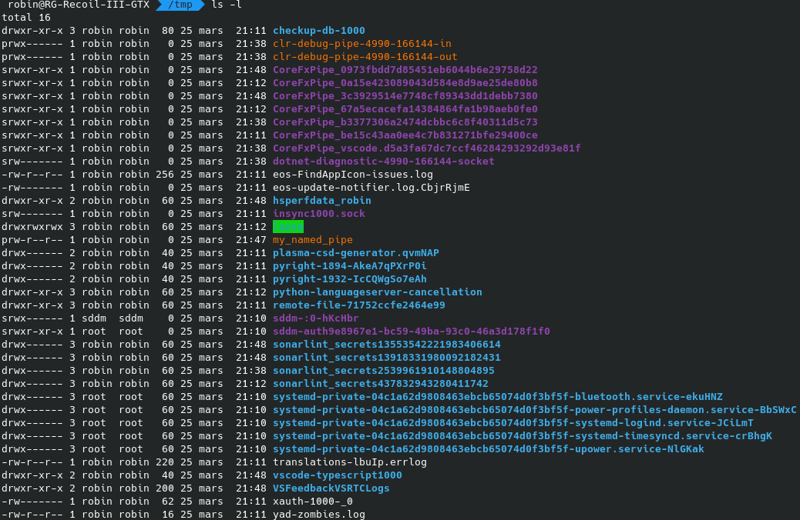

# TD 6 Redirections et Tubes

## Redirections

### Exercice 1

sortie du programme :

``` bash
  ./redir_simple.exe 
  cat foo
total 792
-rw-r--r-- 1 robin robin 338939 23 mars  09:26 06 TD.pdf
-rw-r--r-- 1 robin robin    870 25 mars  23:19 compteRendu.md
-rw-r--r-- 1 robin robin    810 23 mars  23:23 correction.c
-rwxr-xr-x 1 robin robin  18480 23 mars  23:23 correction.exe
-rw-r--r-- 1 robin robin    401 25 mars  22:47 ecrivain.c
-rwxr-xr-x 1 robin robin  18952 25 mars  22:47 ecrivain.exe
-rw-r--r-- 1 robin robin      0 25 mars  23:20 foo
-rw-r--r-- 1 robin robin    372 25 mars  22:42 lecteur.c
-rwxr-xr-x 1 robin robin  17720 25 mars  22:43 lecteur.exe
-rw-r--r-- 1 robin robin 204850 25 mars  22:01 lsl.png
-rw-r--r-- 1 robin robin   2107 24 mars   2018 Makefile
-rw-r--r-- 1 robin robin    666 25 mars  23:10 mypopen.c
-rwxr-xr-x 1 robin robin  17872 25 mars  23:10 mypopen.exe
-rw-r--r-- 1 robin robin   1072 23 mars  11:21 redir.c
-rwxr-xr-x 1 robin robin  19168 23 mars  11:27 redir.exe
-rw-r--r-- 1 robin robin    275 23 mars  10:07 redir_simple.c
-rwxr-xr-x 1 robin robin  17432 23 mars  10:07 redir_simple.exe
-rw-r--r-- 1 robin robin    140 23 mars  20:12 test.c
-rwxr-xr-x 1 robin robin  17352 23 mars  20:12 test.exe
-rwxr-xr-x 1 robin robin    531 23 mars  10:32 tst_redir.sh
-rw-r--r-- 1 robin robin    411 23 mars  11:33 tube_anonyme1.c
-rwxr-xr-x 1 robin robin  17912 23 mars  11:33 tube_anonyme1.exe
-rw-r--r-- 1 robin robin    516 23 mars  19:46 tube_anonyme2.c
-rwxr-xr-x 1 robin robin  18024 23 mars  20:06 tube_anonyme2.exe
-rw-r--r-- 1 robin robin   1213 23 mars  23:44 tube_anonyme2_multi.c
-rwxr-xr-x 1 robin robin  18656 23 mars  23:44 tube_anonyme2_multi.exe
drwxr-xr-x 6 robin robin   4096 27 mars   2017 Win32NamedPipe
```

### Exercice 2

code modifié (switch uniquement) :

``` c
switch (argv[1][0]) {
case 'R':
    
case 'r':
    std_fd = open(argv[2], O_RDONLY);
    dup2(std_fd, 0);

    break;
case 'W':
    
case 'w':
    std_fd = open(argv[2], O_WRONLY | O_CREAT | O_TRUNC, S_IRUSR | S_IWUSR | S_IRGRP | S_IROTH);
    dup2(std_fd, 1);
    break;
default:
    usage(*argv);
}
close(std_fd);
execvp(argv[3], argv+3);
```

## Tubes

### Tubes anonymes (pipe)

#### Exercice 3

code : 

```c
void lecture(int fd){
    char msg[MAXL];
    read(fd, msg, MAXL);
    printf("%s\n", msg);
}

int main() {
    int fds[2];
    pipe(fds);
    write(fds[1], "0123456789", sizeof("0123456789"));
    close(fds[1]);
    lecture(fds[0]);
    close(fds[0]);
    return 0;
}
```

#### Exercice 4

code :

```c
void lecture(int fd){
    char msg[MAXL];
    read(fd, msg, MAXL);
    printf("%s\n", msg);
}

int main() {
    int fds[2];
    pipe(fds);

    switch (fork()) {
    case 0:
        close(fds[1]);
        lecture(fds[0]);
        break;
    
    default:
        close(fds[0]);
        write(fds[1], "0123456789", sizeof("0123456789"));
        break;
    }
    return 0;
}
```

#### Exercice 5

code :

``` c

void lecture(int fd){
    char msg[3];
    int n;
    while((n = read(fd, msg, 3))){
        if(n == 2){
            printf("%c%c\n", msg[0], msg[1]);
        } else if (n == 3){
            printf("%s\n", msg);
        }
    }
}

int main() {
    int fds[2];
    pipe(fds);

    switch (fork()) {
    case 0:
        switch (fork()) {
        case 0:
            char *minAlphabet = "abcdefghijklmnopqrstuvwxyz";
            for(int i = 0 ; i < 26 ; i += 2) {
                write(fds[1], minAlphabet, 2);
                minAlphabet += 2;
                sleep(2);
            }
            exit(0);
        
        default:
            char *majAlphabet = "ABCDEFGHIJKLMNOPQRSTUVWXYZ";
            for(int i = 0 ; i < 26 ; i += 2){
                write(fds[1], majAlphabet, 2);
                majAlphabet += 2;
                sleep(1);
            }
            break;
        }    
        break;
    default:
        close(fds[1]);
        lecture(fds[0]);
        close(fds[0]);
    }
    return 0;
}
```

résultat :

```
 ./tube_anonyme2_multi.exe
AB
ab
CD
cdE
GH
ef
IJ
KL
gh
MN
OP
ij
QR
ST
kl
UV
WX
mn
YZ
op
qr
st
uv
wx
yz
```

### Tube Nommé (named pipe ou FIFO)

#### Exercice 6

##### Question 1 : En faisant ls -l, qu'est-ce qui distingue le fichier my_named_pipe des autres fichiers ?

Dans le résultat de la commande ```ls -l``` le fichier my_named_pipe est distingué par une lettre ```p```.



##### Question 2  : D'après vos connaissances actuelles, que faudrait-il faire pour avoir un système de chat bidirectionnel, c'est à dire que chaque processus soit à la fois lecteur et écrivain ?

Pour que chaque processus soit à la fois lecteur et écrivain, il faudrait créer un deuxième tube nommé.

##### Question 3 : Que se passe-t-il s'il y a plusieurs lecteurs sur un tube nommé ?

Lorsque plusieurs lecteurs sont sur un tube nommé, la lecture s'alterne entre les lecteurs.

### Cas concret processus et tube anonyme : popen

#### Exercice 7

code :
```c
int main(int argc, char *argv[])
{
    if(argc < 2){
        printf("Usage: %s <command>\n", argv[0]);
        return 1;
    } else {
        int fds[2];
        pipe(fds);
        switch (fork()) {
            case 0:
                close(fds[1]);
                dup2(fds[0], 0);
                close(fds[0]);
                execvp(argv[1], argv+1);
                break;
            default:
                close(fds[0]);
                dup2(fds[1], 1);
                close(fds[1]);
                execlp("cat", "cat", NULL);
                break;
        }
    }
    return 0;
}
```

résultat :
```
 ./mypopen.exe ls -l
total 800
-rw-r--r-- 1 robin robin 338939 23 mars  09:26 '06 TD.pdf'
-rw-r--r-- 1 robin robin   5641 25 mars  23:42  compteRendu.md
-rw-r--r-- 1 robin robin    810 23 mars  23:23  correction.c
-rwxr-xr-x 1 robin robin  18480 23 mars  23:23  correction.exe
-rw-r--r-- 1 robin robin    401 25 mars  22:47  ecrivain.c
-rwxr-xr-x 1 robin robin  18952 25 mars  22:47  ecrivain.exe
-rw-r--r-- 1 robin robin   1629 25 mars  23:20  foo
-rw-r--r-- 1 robin robin    372 25 mars  22:42  lecteur.c
-rwxr-xr-x 1 robin robin  17720 25 mars  22:43  lecteur.exe
-rw-r--r-- 1 robin robin 204850 25 mars  22:01  lsl.png
-rw-r--r-- 1 robin robin   2107 24 mars   2018  Makefile
-rw-r--r-- 1 robin robin    653 25 mars  23:47  mypopen.c
-rwxr-xr-x 1 robin robin  17960 25 mars  23:47  mypopen.exe
-rw-r--r-- 1 robin robin   1085 25 mars  23:25  redir.c
-rwxr-xr-x 1 robin robin  19168 25 mars  23:25  redir.exe
-rw-r--r-- 1 robin robin    275 23 mars  10:07  redir_simple.c
-rwxr-xr-x 1 robin robin  17432 23 mars  10:07  redir_simple.exe
-rw-r--r-- 1 robin robin    140 23 mars  20:12  test.c
-rwxr-xr-x 1 robin robin  17352 23 mars  20:12  test.exe
-rwxr-xr-x 1 robin robin    531 23 mars  10:32  tst_redir.sh
-rw-r--r-- 1 robin robin    411 23 mars  11:33  tube_anonyme1.c
-rwxr-xr-x 1 robin robin  17912 23 mars  11:33  tube_anonyme1.exe
-rw-r--r-- 1 robin robin    516 23 mars  19:46  tube_anonyme2.c
-rwxr-xr-x 1 robin robin  18024 23 mars  20:06  tube_anonyme2.exe
-rw-r--r-- 1 robin robin   1155 25 mars  23:36  tube_anonyme2_multi.c
-rwxr-xr-x 1 robin robin  18656 25 mars  23:44  tube_anonyme2_multi.exe
drwxr-xr-x 6 robin robin   4096 27 mars   2017  Win32NamedPipe

```